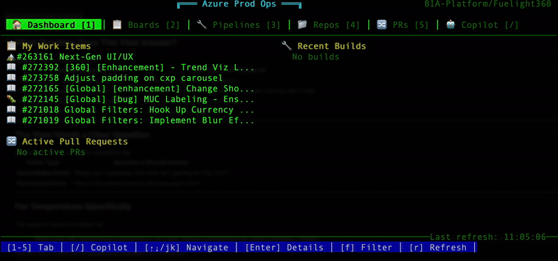

# Azure Prod Ops (APO) CLI



A zero-dependency Terminal User Interface (TUI) for Azure DevOps, built with Go following best engineering practices.

## Features

- 🏠 **Dashboard** - Overview of work items, builds, and PRs
- 📋 **Boards** - View and filter work items assigned to you
- 🔧 **Pipelines** - Browse all pipelines
- 📁 **Repositories** - List all Git repositories  
- 🔀 **Pull Requests** - View active PRs with reviewer status
- 🤖 **Copilot** - Natural language queries for Azure DevOps
- 📄 **Detail Views** - Full work item and PR details with deep links

## Architecture

```
apo/
├── cmd/apo/                    # Application entry point
│   └── main.go
├── internal/
│   ├── agent/                  # Natural language query engine
│   │   └── agent.go            # Intent matching & execution
│   ├── api/                    # Azure DevOps REST client
│   │   └── client.go           # HTTP client with auth
│   ├── config/                 # Configuration management
│   │   └── config.go           # File & env config
│   ├── domain/                 # Business entities (zero deps)
│   │   ├── build.go
│   │   ├── identity.go
│   │   ├── pipeline.go
│   │   ├── project.go
│   │   ├── pullrequest.go
│   │   ├── repository.go
│   │   └── workitem.go
│   └── ui/                     # Terminal UI layer
│       ├── app.go              # Main TUI controller
│       ├── terminal/           # Low-level terminal control
│       │   └── terminal.go     # ANSI codes, raw mode, key reading
│       ├── components/         # Reusable UI components
│       │   └── components.go   # TabBar, StatusBar, List, Input
│       └── views/              # Application views
│           ├── view.go         # View interface & base
│           ├── views.go        # All list views
│           └── details/        # Detail views
│               └── details.go  # WorkItem & PR details
└── go.mod
```

## Design Principles

1. **Zero External Dependencies** - Uses only Go standard library
2. **Clean Architecture** - Domain models have no dependencies
3. **Single Responsibility** - Each file/package has one purpose
4. **Interface Segregation** - Small, focused interfaces
5. **Dependency Injection** - Components receive dependencies

## Installation

```bash
go build -o apo ./cmd/apo
```

## Configuration

### Config File
Create `~/.config/apo/config.json`:
```json
{
  "organization": "your-org",
  "project": "your-project",
  "pat": "your-personal-access-token"
}
```

### Environment Variables (override config)
```bash
export AZURE_DEVOPS_ORG=your-org
export AZURE_DEVOPS_PROJECT=your-project
export AZURE_DEVOPS_PAT=your-pat
```

### Interactive Setup
```bash
apo config
```

## Usage

### Launch TUI
```bash
apo              # Default: launch TUI
apo ui           # Explicit TUI launch
```

### CLI Queries
```bash
apo "show failed builds"
apo ask "what PRs are open?"
apo "what work items are assigned to me?"
```

## TUI Navigation

| Key | Action |
|-----|--------|
| `1-5` | Switch tabs |
| `/` | Open Copilot |
| `↑↓` or `jk` | Navigate |
| `g` / `G` | Top / Bottom |
| `Enter` | Open detail view |
| `f` | Filter list |
| `Tab` | Cycle tabs |
| `r` | Refresh data |
| `Esc` | Back / Cancel |
| `q` | Quit |

## Natural Language Queries

Examples:
- "What work items are assigned to me?"
- "Show failed builds"
- "List all pipelines"
- "What PRs are open?"
- "Show running builds"
- "List repositories"

## PAT Permissions Required

- **Work Items**: Read
- **Build**: Read  
- **Code**: Read
- **Project and Team**: Read

## Development

### Build
```bash
go build -o apo ./cmd/apo
```

### Test
```bash
go test ./...
```

### Project Stats
- ~2,000 lines of Go code
- Zero external dependencies
- Single static binary output

## License

MIT
